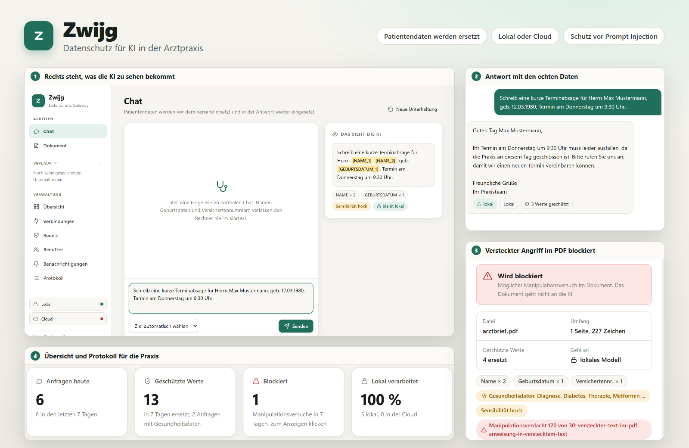
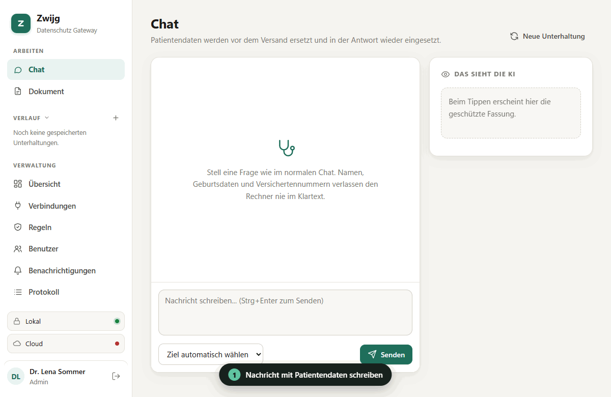

# Zwijg

<p align="center">
  <a href="https://github.com/kschnieders/zwijg/actions/workflows/tests.yml"></a>
  <a href="https://github.com/kschnieders/zwijg/actions/workflows/gitleaks.yml"></a>
  <a href="https://github.com/kschnieders/zwijg/actions/workflows/codeql.yml"></a>
  <a href="https://github.com/kschnieders/zwijg/releases/latest"></a>
  <a href="https://github.com/kschnieders/zwijg/releases"></a>
  <a href="https://github.com/kschnieders/zwijg/stargazers"></a>
  <a href="LICENSE"></a>
  <a href="https://dotnet.microsoft.com"></a>
</p>



Ein kleines LLM Gateway für Arztpraxen, geschrieben in C# / .NET 9.

Zwijg sitzt zwischen euren Programmen und dem Sprachmodell. Bevor eine Anfrage rausgeht, werden Patientendaten durch Platzhalter ersetzt. In der Antwort setzt Zwijg die echten Daten wieder ein.

```
Herr Max Mustermann, geb. 12.03.1980, KVNR A123456789
        ↓
Herr [NAME_1] [NAME_2], geb. [GEBURTSDATUM_1], KVNR [VERSICHERTENNR_1]
```

## So sieht das aus



1. Du schreibst ganz normal, mit Namen, Geburtsdatum und Versichertennummer
2. Rechts siehst du live, was die KI bekommt: nur Platzhalter
3. Die KI antwortet mit den Platzhaltern
4. Zwijg setzt die echten Daten wieder ein
5. Im Protokoll steht nur, was wirklich rausging

Für die Aufnahme lieferte ein Demo Modell eine feste Antwort. Erkennung, Platzhalter, Wiedereinsetzen und Protokoll sind echt.

## Was es macht

- **Pseudonymisierung**: Namen, Orte, Geburtsdaten, Versichertennummern (in jedem Format, auch bei Tippfehlern im Wort davor), Patienten und Fallnummern, lange Ziffernfolgen, Telefon, E-Mail, IBAN, Adressen
- **Gesundheitsdaten**: über 1.100 Fachbegriffe auf Deutsch und Latein, typische Endungen wie -itis oder -ektomie, Wirkstoffe, Messwerte und ICD Codes werden erkannt. Sie bleiben im Text stehen, aber Person plus Gesundheit gilt immer als hoch sensibel und bleibt lokal
- **Schutz vor Prompt Injection**: verdächtige Anweisungen werden blockiert, auch versteckter Text in PDFs (weiße oder winzige Schrift, unsichtbarer Render-Modus, Text außerhalb der Seite) und unsichtbare Unicode Zeichen. Die PDF Prüfung ist eine Heuristik und findet nicht jeden Trick, z.B. keinen Text unter einem Bild
- **Texterkennung**: eingescannte oder gefaxte PDFs und Fotos von Befunden werden lokal mit Tesseract gelesen und danach genauso geschützt
- **Diktieren**: im Chat sprechen statt tippen, Whisper schreibt lokal mit, die Aufnahme verlässt die Praxis nicht
- **Protokoll**: wer hat wann was gefragt, nur pseudonymisiert gespeichert, mit Hashkette gegen nachträgliche Änderungen
- **Lokal oder Cloud**: sensible Anfragen gehen an ein lokales Modell (z.B. Ollama), harmlose dürfen in die Cloud

## Anleitungen

Kurze Anleitungen für den Alltag stehen unter [docs](docs/README.md): erste Schritte, lokale KI einbinden, Cloud Anbieter, im Chat arbeiten, Texterkennung für Scans, Diktieren, Schutz anpassen, andere Programme anbinden und Betrieb in der Praxis.

## Herunterladen

Unter [Releases](https://github.com/kschnieders/zwijg/releases/latest) gibt es für jede Version:

- `zwijg-x.y.z-win-x64.zip`: für Windows. Entpacken, `Zwijg.Gateway.exe` starten und http://localhost:5000 öffnen
- `zwijg-x.y.z-linux-x64.zip`: für Linux. Entpacken, `./Zwijg.Gateway` starten und http://localhost:5000 öffnen
- `zwijg-x.y.z-docker.zip`: `docker-compose.yml` für Zwijg mit Ollama, siehe unten

.NET muss dafür nicht installiert sein. Beim ersten Start steht ein Startschlüssel für den Admin in der Konsole.

Oder direkt als Docker Image:

```bash
docker run -d -p 8080:8080 -v zwijg-data:/app/data ghcr.io/kschnieders/zwijg:latest
```

## Schnellstart


```bash
cd src/Zwijg.Gateway
dotnet run
```

Beim ersten Start schreibt Zwijg einen zufälligen Startschlüssel für den Admin in die Konsole. Damit anmelden und am besten gleich ein Passwort festlegen. Im Development Modus antwortet das lokale Ziel mit einem Echo, man braucht also kein Modell zum Ausprobieren.

```bash
curl http://localhost:5247/v1/chat/completions \
  -H "Authorization: Bearer DEIN_SCHLÜSSEL" \
  -H "Content-Type: application/json" \
  -d '{"model":"auto","messages":[{"role":"user","content":"Herr Max Mustermann, geb. 12.03.1980, hat Fieber"}]}'
```

Die API ist OpenAI kompatibel. Bestehende Tools müssen nur die Base URL auf Zwijg umstellen. Function Calling geht nicht, siehe [Andere Programme anbinden](docs/programme-anbinden.md).

## Weboberfläche

Nach dem Start die Adresse im Browser öffnen und mit dem Startschlüssel aus der Konsole anmelden. Welche Adresse, hängt davon ab, wie Zwijg gestartet wurde:

| Gestartet als | Adresse |
|---|---|
| Fertiges Paket für Windows oder Linux | http://localhost:5000 |
| Aus dem Quellcode mit `dotnet run` | http://localhost:5247 |
| Docker | http://localhost:8080 |

Die genaue Adresse steht beim Start auch in der Konsole ("Now listening on").

- **Chat**: normal chatten, daneben sieht man live, was die KI zu sehen bekommt. Eigene geheime Stellen, etwa ein Projektname oder eine Kontonummer, lassen sich im Eingabefeld markieren und mit "Verstecken" (oder Strg+Umschalt+H) für die ganze Unterhaltung durch einen Platzhalter ersetzen. Die letzten Unterhaltungen stehen in der Seitenleiste, mit Anpinnen, Umbenennen und Löschen (auch per Rechtsklick). Sie liegen verschlüsselt, sind nur für die Person selbst lesbar und werden nach einstellbarer Zeit gelöscht. Die Titel in der Seitenleiste enthalten keine Patientendaten.
- **Dokument**: PDF oder Text hochladen, erst prüfen (versteckter Text, Manipulationsversuche, erkannte Patientendaten, geschützte Fassung zum Ansehen und Kopieren), dann befragen
- **Text schützen**: für Programme, die sich nicht anbinden lassen. Text einfügen, geschützte Fassung kopieren und dort einfügen, die Antwort wieder einfügen und mit den echten Daten zurückbekommen. Die Zuordnung bleibt nur im Browser. Es gelten dieselben Regeln wie für die Cloud.
- **Übersicht** (Admin): Anfragen, geschützte Werte, blockierte Versuche und Verlauf der letzten 14 Tage
- **Verbindungen** (Admin): Claude, ChatGPT, Mistral, Gemini, Groq, Ollama, LM Studio oder ein eigener Server. Mit Test und Modellliste.
- **Regeln** (Admin):
  - Anweisungen an die KI (Sprache, Anrede, Zielgruppe, Ton, Länge, Format, eigene Regeln, Hinweis unter jeder Antwort)
  - eigene Schutzregeln mit Wörtern oder regulären Ausdrücken: ersetzen, nur lokal, blockieren oder nur protokollieren
  - Vorlagen, die im Chat als Knöpfe erscheinen. Mit Feldern wie `{{Patient}}`, `{{Absagetermin:termin}}` oder `{{Grund:auswahl=Krankheit|Urlaub}}` fragt Zwijg die Werte in einem kleinen Formular ab. Direkt ausgeführte Vorlagen zeigen im Chat nur eine Karte mit den Werten, die Anweisung geht im Hintergrund an die KI.
  - Weiterleitung lokal oder Cloud, Schutz vor Manipulation, eigene Namens und Ortslisten
- **Benutzer** (Admin): Schlüssel pro Person, Rechte (Vorschau, Dokumente, Cloud), Tageslimit, Sperren ohne Löschen
- **Benachrichtigungen** (Admin): Hinweise ans Team mit Stufe, Zielgruppe und Zeitraum, erscheinen oben in der App
- **Protokoll** (Admin): wer hat wann was gefragt, mit Echtheitsprüfung und CSV Export

Anmelden geht mit Benutzername und Passwort (auf Wunsch 14 Tage angemeldet bleiben) oder mit dem Zugangsschlüssel. Wer ein Passwort hat, braucht den Schlüssel nur noch für Programme, die die API nutzen. Admins können ihn unter Benutzer entfernen, dann geht die Anmeldung nur noch mit Passwort. Admins vergeben ein Startpasswort, das beim ersten Anmelden geändert werden muss. Passwörter liegen nur als PBKDF2 Hash vor, nach mehreren Fehlversuchen wird kurz gesperrt, und Sperren oder Passwortwechsel beenden laufende Sitzungen sofort. Läuft Zwijg auf einem Server im Praxisnetz, bitte HTTPS einrichten, damit Passwörter nicht lesbar durchs Netz gehen.

Hell oder dunkel lässt sich im Konto Menü unten links umschalten. Standard ist die Einstellung des Systems.

Rechte pro Benutzer setzt der Server durch, nicht nur die Oberfläche. Wer "nur lokal" darf, kommt auch über die API nicht in die Cloud.

Änderungen gelten sofort, ohne Neustart. Gespeichert wird alles in `data/settings.json`. API Schlüssel der Anbieter liegen dort nur verschlüsselt, Zugangsschlüssel nur als Hash.

## Kostenlos mit Ollama

Ein lokales Modell kostet nichts und die Daten bleiben auf dem Rechner. Eine Grafikkarte mit 8 GB reicht für ein 7B Modell.

```bash
winget install Ollama.Ollama
ollama pull qwen2.5:7b
dotnet run --launch-profile ollama
```

Läuft Ollama auf einem Server im Praxisnetz, einfach unter Verbindungen die Adresse eintragen, z.B. `http://192.168.1.50:11434/v1`.

## Claude, ChatGPT und andere

Unter Verbindungen den Anbieter wählen und den API Schlüssel eintragen. Claude wird über das offizielle Anthropic SDK angesprochen, alle anderen über die OpenAI kompatible API. Ein normales Claude oder ChatGPT Abo reicht nicht, die APIs werden getrennt abgerechnet.

Cloud Anbieter bekommen nur, was laut Regeln raus darf, und immer pseudonymisiert. Vorsicht bei kostenlosen Tarifen, dort dürfen Anbieter Eingaben oft zum Training nutzen.

## Endpunkte

| Methode | Pfad | Zweck |
|---|---|---|
| POST | `/v1/chat/completions` | Chat, wie bei OpenAI |
| POST | `/v1/documents/ask` | PDF oder Text hochladen (`file`) und Frage stellen (`question`) |
| POST | `/v1/check` | Zeigt nur, was erkannt wird, ohne Modell |
| GET | `/admin/audit` | Protokoll durchsuchen (Admin), Filter: `q`, `from`, `to`, `user`, `action`, `status`, `route`, `limit`, `offset` |
| GET | `/admin/audit/{id}` | Einzelner Eintrag mit Echtheitsprüfung (Admin) |
| GET | `/admin/audit/verify` | Hashkette prüfen (Admin) |
| GET | `/admin/audit/export.csv` | Protokoll als CSV (Admin) |
| GET | `/admin/version` | Installierte und neueste Version (Admin) |
| GET | `/admin/settings` | Einstellungen lesen (Admin) |
| POST, PUT, DELETE | `/admin/connections`, `/admin/users`, `/admin/policy`, `/admin/routes` | Einstellungen ändern (Admin) |
| GET | `/health` | Status |

Das Ziel lässt sich mit `model: "local/llama3.1"` oder dem Header `X-Zwijg-Route: local` wählen. Die Cloud kann ein Client aber nie erzwingen, wenn die Regeln es verbieten.

## Konfiguration

Im Alltag läuft alles über die Weboberfläche. `appsettings.json` wird nur beim allerersten Start als Vorlage genutzt, wenn es noch keine `data/settings.json` gibt. Dort kann man Startbenutzer, erste Verbindungen und Regeln vorgeben.

Gibt es beim ersten Start keinen Admin, schreibt Zwijg einmalig einen Startschlüssel in die Konsole.

Den `data` Ordner sichern, aber nie ins Repo packen. Er enthält Einstellungen, Protokoll und die Schlüssel zum Entschlüsseln.

## Alles lokal mit Docker

```bash
ZWIJG_ADMIN_KEY=$(openssl rand -hex 24) docker compose up -d
docker compose exec ollama ollama pull llama3.1:8b
```

Den Schlüssel einmal notieren, damit meldet sich der Admin an. Dann läuft Zwijg auf Port 8080 und nichts verlässt den Rechner.

## Aktualisieren

Als Admin steht in der Übersicht unter Status die installierte Version. Gibt es eine neuere, erscheint dort ein Hinweis. Ein Klick zeigt, was neu ist, und die passenden Befehle. Zwijg fragt dafür beim Öffnen der Übersicht höchstens alle 12 Stunden bei GitHub nach der neuesten Versionsnummer. Es werden keine Daten aus der Praxis übertragen, und die Prüfung lässt sich im selben Fenster abschalten.

| Installation | Update |
|---|---|
| Windows Paket | im Zwijg Ordner `powershell -ExecutionPolicy Bypass -File update.ps1` |
| Linux Paket | Zwijg beenden, dann im Zwijg Ordner `./update.sh` |
| Docker | `docker compose pull && docker compose up -d` |
| Quellcode | `git pull`, dann neu starten |

Die Skripte sichern vorher den `data` Ordner und lassen ihn unangetastet. Einstellungen, Protokoll und Verlauf haben eine Formatversion. Neue Versionen stellen ältere Dateien beim Start automatisch um und legen vorher eine Sicherung an (`settings.json.v0.bak` usw.).

## Tests

```bash
dotnet test
```

Bei jedem Push prüft GitHub automatisch:

- **Tests**: alle Tests, dazu ob ein genutztes Paket eine bekannte Sicherheitslücke hat, und ein Probebau des Docker Images
- **Gitleaks**: sucht nach versehentlich eingecheckten Passwörtern und Schlüsseln
- **CodeQL**: Sicherheitsanalyse des Codes, zusätzlich einmal pro Woche

Dependabot meldet sich einmal pro Woche per Pull Request, wenn es neue Versionen von Paketen, Actions oder dem Docker Image gibt.

## Grenzen

Die Erkennung läuft in zwei Stufen. Zuerst Regeln: rund 1.200 Vornamen und 1.200 Nachnamen (auch türkische, polnische, russische, arabische, griechische, italienische und vietnamesische), alle rund 60.000 Gemeinden, Ortsteile und Landkreise in Deutschland (aus GeoNames), typische Ortsendungen und Kontext wie "Herr", "geb.", "wohnt in", "NACHNAME, Vorname", Namenslisten oder Terminlisten ("8:30 Kaminski"). Größere Städte werden immer erkannt, kleine Orte und solche, die auch ein normales Wort sind (Essen, Halle, Bruch), nur mit Hinweis wie "in", "aus" oder "Landkreis". Nach Personen benannte Krankheiten wie Morbus Parkinson oder Hashimoto bleiben stehen.

In drei Prüfkatalogen mit 164 Stellen aus typischen Praxistexten erkennen die Regeln alles, ohne ein normales Wort zu ersetzen. Der Katalog läuft bei jedem Test mit (`DetectionBenchmarkTests`). Ganz ohne Lücken geht es trotzdem nicht: Ein seltener Nachname, der allein und ohne jeden Zusammenhang im Satz steht, sieht für Regeln aus wie ein normales Wort. Dafür kann zusätzlich das lokale Modell suchen (unter Regeln einschalten). Das kostet pro neuem Text etwa 0,3 Sekunden. Eigene Listen für Namen und Orte aus der Umgebung helfen ebenfalls.

Für Scans und Fotos braucht es Tesseract auf dem Rechner, siehe [Texterkennung](docs/texterkennung.md). Handschrift erkennt Tesseract kaum. Das Mikrofon zum Diktieren gibt der Browser nur über HTTPS oder auf localhost frei, siehe [Diktieren](docs/diktieren.md). Streaming geht, die Antwort kommt aber am Stück, weil Zwijg erst die ganze Antwort braucht, um die Platzhalter sicher zurückzutauschen.

## Haftungsausschluss

Zwijg ist ein Hilfsmittel und wird ohne Gewähr bereitgestellt, soweit gesetzlich zulässig (siehe Abschnitte 15 und 16 der AGPL).

- Die Erkennung von Patientendaten ist gut, aber nicht vollständig. Bitte vor dem Einsatz mit echten Daten ausprobieren und im Protokoll prüfen, was rausgeht.
- Antworten der KI können falsch sein und müssen fachlich geprüft werden. Zwijg ist kein Medizinprodukt und trifft keine Entscheidungen über Diagnose oder Behandlung.
- Zwijg ersetzt keine Datenschutz oder Rechtsberatung. Verantwortlich für den Datenschutz bleibt die Praxis, dazu gehören etwa Verträge zur Auftragsverarbeitung mit Cloud Anbietern und gegebenenfalls eine Datenschutz Folgenabschätzung.

## Lizenz

Entwickelt von Kay Schnieders, https://github.com/kschnieders/zwijg

Zwijg ist freie Software unter der GNU AGPL 3.0, siehe [LICENSE](LICENSE). Du darfst es nutzen, verändern und weitergeben. Wer eine veränderte Fassung weitergibt oder anderen als Dienst anbietet, muss den Quellcode dazu ebenfalls offenlegen.

Zusätzlich gilt nach Abschnitt 7 der AGPL: Die Nennung von Kay Schnieders als ursprünglichem Autor mit Link zum Repository muss im Fenster "Über Zwijg" erhalten bleiben, und veränderte Fassungen müssen als verändert erkennbar sein. Die genauen Bedingungen stehen in [NOTICE](NOTICE).

Wer mitmachen möchte, findet in [CONTRIBUTING.md](CONTRIBUTING.md) den Ablauf und die Regeln zu den Rechten an Beiträgen.

Die genutzten Bibliotheken und ihre Lizenzen stehen in [THIRD-PARTY-NOTICES.md](THIRD-PARTY-NOTICES.md) und in der App unter "Über Zwijg" (Konto Menü unten links oder auf der Anmeldeseite).
